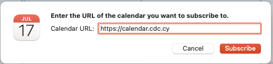
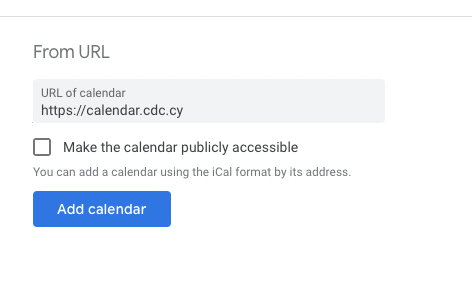

# GitEvents ICS Generator

GitEvents ICS Generator is a GitHub Action to fetch and parse Issues and
generate an iCalendar (.ics) file which can be hosted and shared for calendar
subscriptions.

## Features

- :robot: generate, commit and push an .ics file

## Installation & Usage

```yml
name: GitEvents ICS Generator

on:
  issues:
    types: [labeled]
  schedule:
    - cron: '0 0 * * *'

jobs:
  generate:
    runs-on: ubuntu-latest
    steps:
      - uses: actions/checkout@v3
      - uses: actions/setup-node@v3
      - name: GitEvents ICS Generator
        uses: gitevents/ics@1.0.0
        with:
          repo-token: ${{ secrets.GITHUB_TOKEN }}
          default-timezone: 'Europe/Athens'
          locations: 'locations.json'
      - uses: actions/checkout@v3
      - run: |
          git config user.name gitevents[bot]
          git config user.email ics@gitevents.org
          git add events.ics
          git commit -m "update calendar file"
          git push
```

### Hosting the .ics file

This action creates / updates a file (`events.ics` in the example above) with
the current calendar, once a day. Unfortunately, the `mime-type` is set to
`text/plain`, so some calendar apps don't understand this is a calendar file.

If you're using CloudFlare, you can create a CloudFlare Worker to host this on
your own domain with the appropriate headers. Just create a new service and a
HTTP Route to the worker:

```
addEventListener("fetch", event => {
  event.respondWith(handleRequest(event.request))
})

async function handleRequest(request) {
  const ics = await fetch('https://raw.githubusercontent.com/cyprus-developer-community/events/main/events.ics')
  const res = new Response(ics.body, ics)
  res.headers.set('content-type','text/calendar')
  return res
}
```

Replace the URL to your `events.ics` file. Now you can easily subscribe to the
calendar:




Direct link for
[Google Calendar Subscriptions from URL](https://calendar.google.com/calendar/u/0/r/settings/addbyurl)

## Development

Local development and testing works with [act](https://github.com/nektos/act).

```
    $ act
    $ act --list
    $ act workflow_dispatch
```

The github token can be stored in `.secrets`:

```
GITHUB_TOKEN=ghp_123xyz
```

Example `locations.json` file:

```
[
  {
    "id": "idea-cy",
    "name": "IDEA Cyprus, Nicosia",
    "city": "Nicosia",
    "geo": [35.172405, 33.36224]
  }
]
```

## Known issues and TODOs

- add xml/json/atom rss feed
- add tests
- recurring events
- add more flexibility to date and time parser
- parse markdown into plaintext and html for ics content
- add error handling

## License

Licensed under [MIT](./LICENSE).

Here is a list of all the licenses of our
[production dependencies](./dist/licenses.txt)
